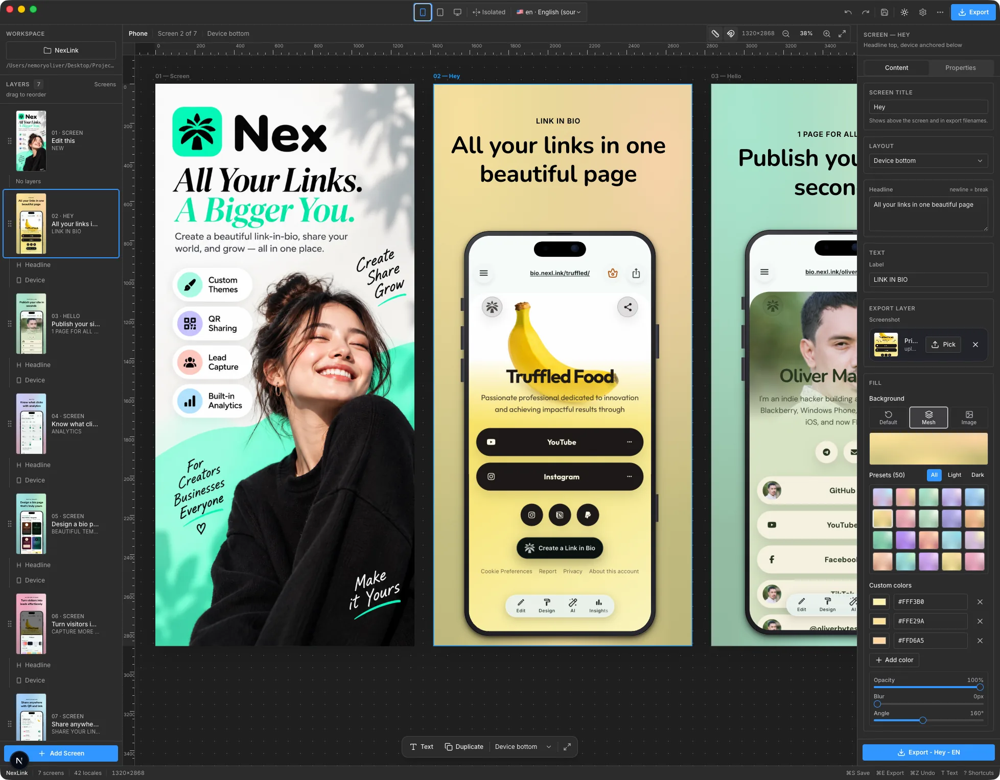

# StoreShot

[](LICENSE)
[](https://github.com/stackwares/storeshot-electron/actions/workflows/ci.yml)

[](electron/main.js)
[](https://nextjs.org/)

Design **App Store and Google Play marketing screenshots** on a connected
canvas — layouts, device frames, locales, AI translation, and one-click
store-ready export.



## Features

- **Connected canvas editor** — every screen sits on one horizontal canvas, so
  phones, captions, and elements can straddle screen boundaries and export as
  exact split crops. Isolated mode keeps each screen self-contained.
- **Pixel-exact device frames** — iPhone 6.9" and iPad 13" vector frames with
  true screen aspects; screenshots render edge-to-edge.
- **Locales done right** — per-store folder codes (Apple vs. Google Play),
  Fastlane/Standard/Flat export layouts, gap-free screen numbering.
- **AI translation** — bring your own OpenRouter-compatible key; translate one
  screen, one locale, or every locale at once (5-way concurrent with status).
- **One-click export** — bulk PNG bundles at store dimensions with automatic
  retries and verified-complete downloads.
- **Git-trackable projects** — the project file lives in your workspace folder;
  commit it and resume on any machine.
- **MCP server** — drive the editor from Claude/Agents over stdio
  (`get_project`, `lint_deck`, `render_export`, `translate_locale`, …).

## Quick start

**Web (any platform):**

```bash
bun install
bun dev        # http://localhost:3000
```

**Native macOS app:**

```bash
bun install
bun run build
bun run dist:mac   # → StoreShot.dmg
```

Or run the shell against the dev server:

```bash
bun dev                     # terminal 1
bun run electron:dev        # terminal 2
```

Other commands: `bun run typecheck`, `bun run lint`, `bun test` (vitest).

## How it works

| Area | Details |
| ---- | ------- |
| **Workspaces** | The toolbar folder button picks any folder as the active workspace. The app only touches `<workspace>/screenshots/` (project JSON + `uploads/`). Switching flushes pending saves first. |
| **Persistence** | Autosave (~600ms) writes `screenshots/app-store-screenshots.json` and mirrors to `localStorage` for instant paint. On load the file always wins. Saves are shape- and size-validated, written atomically. |
| **Locales** | `Settings → Locales` manages App Store Connect codes. `en` is the editing/translation source; exports use store codes (`en-US`, `sl-SI` on Apple vs `sl` on Play, …). |
| **Translate** | Keys stay in browser `localStorage` and go only to your provider — never to this server, git, or logs. |
| **Backgrounds** | 50 pastel mesh presets (light/dark), custom colors/angle/opacity/blur, or an uploaded image — globally or per screen. |
| **MCP** | `bun run mcp` starts the stdio server; `bun run mcp:call --list tools` explores it. Same localhost-only trust model as the API. |

## Project layout

```
src/
  app/                 Next.js routes + /api (project, upload, workspaces)
  components/editor/   canvas, toolbar, inspector, dialogs, device frames
  components/ui/       shadcn/ui primitives
  lib/                 constants, locales, fonts, mesh presets, i18n, native bridge
  mcp/                 opt-in stdio MCP server + client
electron/              main, preload, menu, prefs, updater (macOS shell)
```

Tweak canvas sizes in `src/lib/constants.ts`, store folder codes in
`src/lib/locale.ts`, fonts in `src/lib/fonts.ts`, mesh presets in
`src/lib/mesh-presets.ts`.

## Security

Local-only tool, document-only by design: the `/api/*` endpoints accept any
absolute workspace path with no authentication — **do not expose the server
beyond localhost, do not run it for multiple users**. See
[SECURITY.md](SECURITY.md) for the full policy and how to report
vulnerabilities.

## Contributing

Small, focused PRs merge fastest. See [CONTRIBUTING.md](CONTRIBUTING.md), and
please follow the [Code of Conduct](CODE_OF_CONDUCT.md).

## Credits

Built by [Stackwares](https://github.com/stackwares) — founded by
[Oliver Martinez](https://bio.nexl.ink/oliverbytes).

## License

[MIT](LICENSE) © 2026 Oliver Martinez
